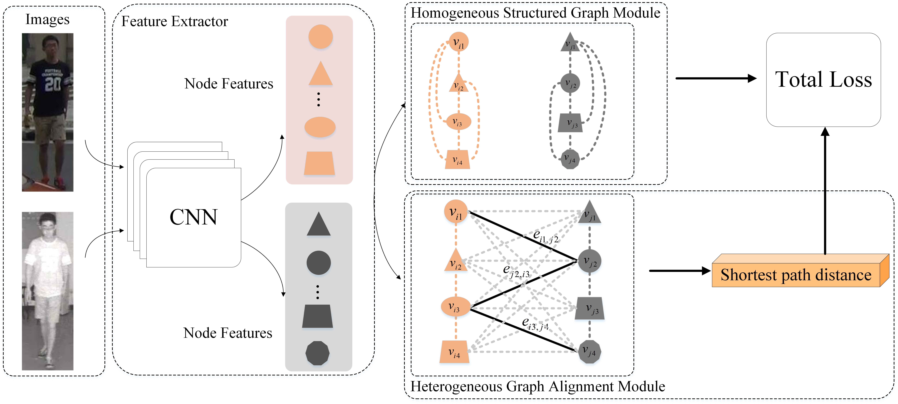

Pytorch Code of  our approach for "Homogeneous and Heterogeneous Relational Graph for Visible-infrared Person Re-identification" in
[PDF](https://arxiv.org/abs/2109.08811)



### Results on the SYSU-MM01 Dataset an the RegDB Dataset 
| Method | Datasets                   | Rank@1    | mAP       |
| ------ | -------------------------- | --------- | --------- |
| Ours   | #SYSU-MM01 (All-Search)    | ~ 78.10 % | ~ 72.88 % |
| Ours   | #SYSU-MM01 (Indoor-Search) | ~ 81.70 % | ~ 81.44 % |
| Ours   | #RegDB                     | ~ 94.92 % | ~ 94.58 % |


*The code has been tested in Python 3.7, PyTorch=1.0. Both of these two datasets may have some fluctuation due to random splitting

### **1. Prepare the datasets.**

- (1) RegDB Dataset [1]: The RegDB dataset can be downloaded from this [website](http://dm.dongguk.edu/link.html) by submitting a copyright form.

- (2) SYSU-MM01 Dataset [2]: The SYSU-MM01 dataset can be downloaded from this [website](http://isee.sysu.edu.cn/project/RGBIRReID.htm).

   - run `python pre_process_sysu.py`  in to pepare the dataset, the training data will be stored in ".npy" format.

### 2. Training.
  - `--dataset`: which dataset "sysu" or "regdb".

  - `--lr`: initial learning rate.
  
  - `--gpu`:  which gpu to run.

You may need manually define the data path first.


### 3. References

```
[1] D. T. Nguyen, H. G. Hong, K. W. Kim, and K. R. Park. Person recognition system based on a combination of body images from visible light and thermal cameras. Sensors, 17(3):605, 2017.
```

```
[2] A. Wu, W.-s. Zheng, H.-X. Yu, S. Gong, and J. Lai. Rgb-infrared crossmodality person re-identification. In IEEE International Conference on Computer Vision (ICCV), pages 5380–5389, 2017.
```

```
[3] M. Ye, Z. Wang, X. Lan, and P. C. Yuen. Visible thermal person reidentification via dual-constrained top-ranking. In International Joint Conference on Artificial Intelligence (IJCAI), pages 1092–1099, 2018.
```

```
[4] Liu H, Tan X, Zhou X. Parameter sharing exploration and hetero-center triplet loss for visible-thermal person re-identification[J]. IEEE Transactions on Multimedia, 2020.
```

```
[5] Ye, Mang, et al. "Deep learning for person re-identification: A survey and outlook." IEEE Transactions on Pattern Analysis and Machine Intelligence, 2021.
```

```
[6] Zhang X, Luo H, Fan X, et al. Alignedreid: Surpassing human-level performance in person re-identification[J]. arXiv preprint arXiv:1711.08184, 2017.
```
